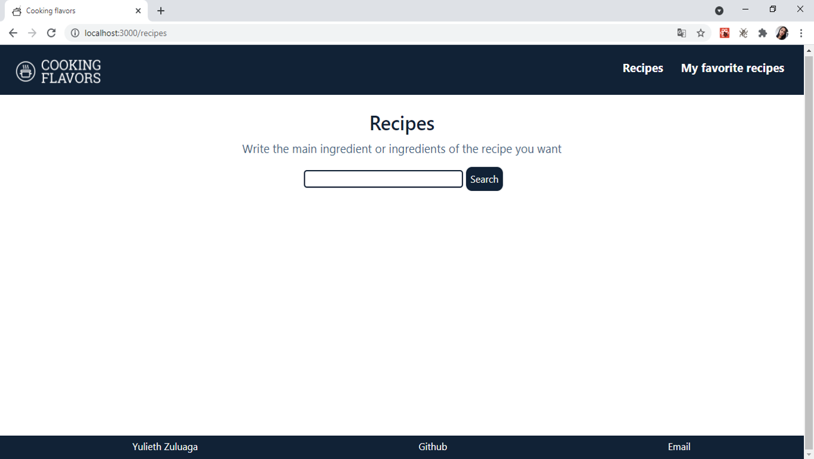
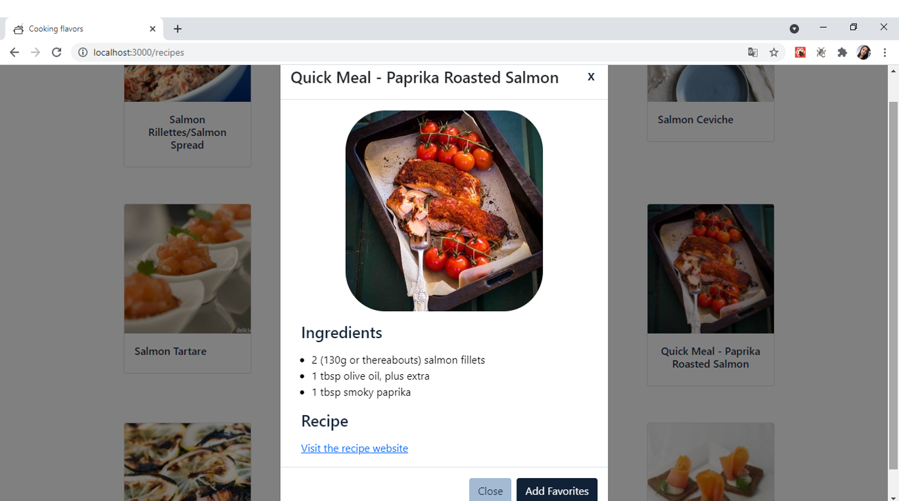
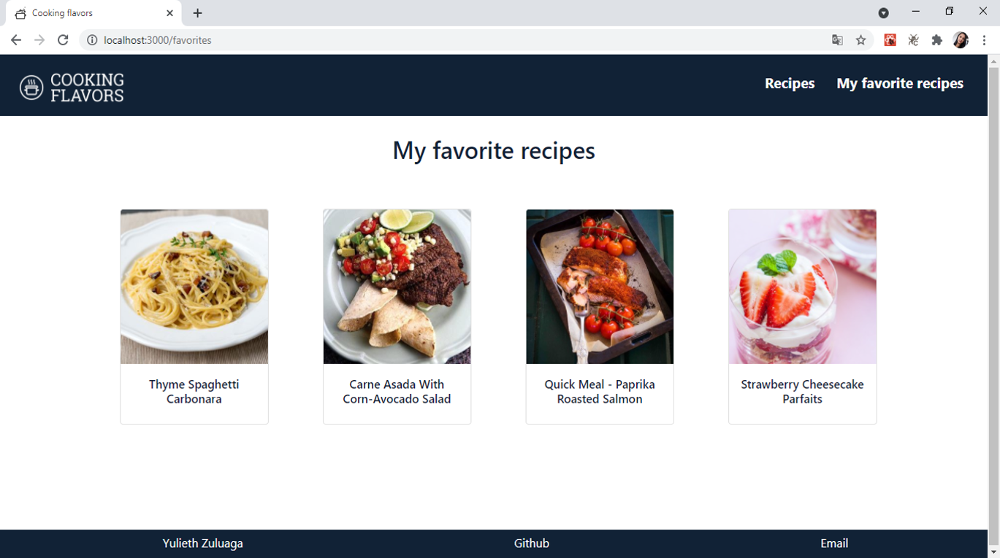

# Cooking flavors
Cooking flavors is a recipe app. The application allows you to search for all kinds of recipes, to add the recipes you like to favorite recipes, to add comments to favorite recipes and to remove recipes from favorites.

## Features
Cooking flavors platform features:

### Search recipes
Find all kinds of recipes that you want to prepare.


### View the recipe and add to favorites

You can see the ingredients, the link to the recipe and you can add the recipe to favorites.


### List my favorite recipes

In my favorite recipes you can find all the recipes you saved.


### Add comments and delete the recipe

In your favorite recipes you can add comments or if you don't like the recipe, you can delete it.


## Requirements
- To run the program you will need **node** and **npm** installed globally on your machine.
-  You must create an account in Edaman to obtain the api key:
```
https://developer.edamam.com/edamam-recipe-api
```

## Instructions

### Clone repository
To clone the repository, you must type the following command:
```
$ git clone https://github.com/yulyzulu/food-project.git
```

### Installation

In your console you need to enter to food-project directory, and you must execute the following command:

```
$ npm install
```
This command will download the packages necessary to run the program.

### Keys
After the Edaman account is created, you must create a file called keys.js in the /src/components directory, and enter the keys as follows:
```
export const APP_ID = 'ADD_APP_ID';
export const APP_KEY = 'ADD_APP_KEY';
```

### Execution
In the food-project directory type the following command:

```
$ npm run start
```
### Interaction
Now you can interact with the application, search for recipes, add to favorites, comment on recipes and delete them.

## Stack
The application was developed with ReactJs.
- Create-react-app was used to create the project.
- React Router Dom was used for navigation.
- Redux was used to handle the state.
- Bootstrap was used to give some styles.
- Axios was used for the API call.

## Author
- Yulieth Zuluaga [Github](https://github.com/yulyzulu) [LinkedIn](https://www.linkedin.com/in/yuliethzuluaga/)